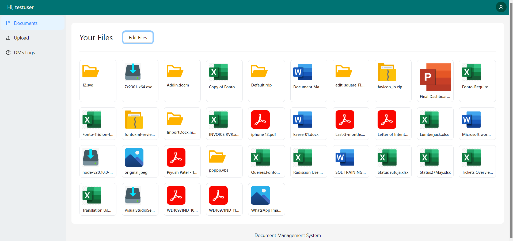
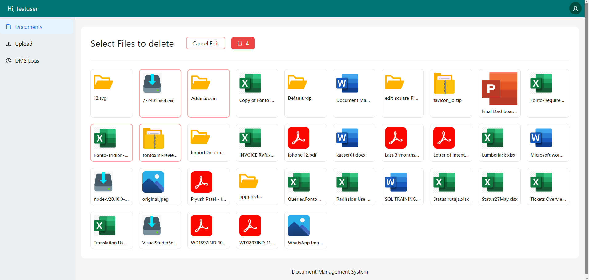
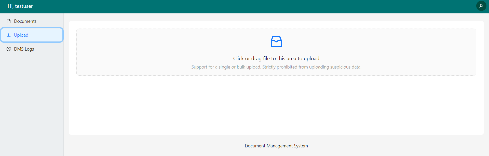
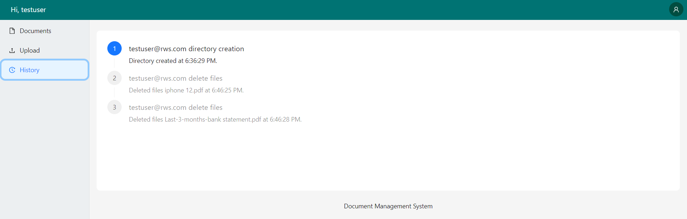

# Document Management System (DMS)
The Document Management System (DMS) is a robust and user-friendly application designed to help individuals and organizations manage their files effectively in one centralized location. With a focus on simplicity and efficiency, the DMS allows users to easily upload, update, and preview documents while keeping track of their file history.






## Key Features
### Content Management:
- Upload files and Easily manage the in one place
- Update files.
- Preview files.

### Usage
- Access: Open the DMS to interact with Your files.
- Commands: Use simple commands to create, update, and save Files.


## Setup 
```bash
npm install --save
```
## Run
```bash
 npm run dev
 ```

## Whom to Talk ?


> Piyush Patel
> piyushpatel2053@gmail.com
> [Github](https://github.com/piyush2053)
